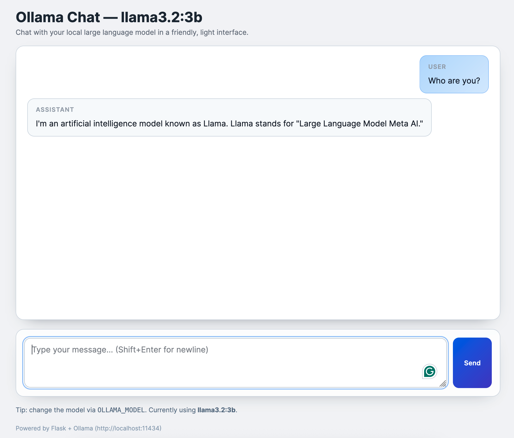

# Local Chatbot

A lightweight Flask app for chatting with a local Ollama large language model. The UI streams responses as they arrive and keeps the full back-and-forth history for the current browser session.



## Features

- 🔁 **Streaming chat** – forwards Ollama tokens to the browser in real time.
- 🧠 **Conversation memory** – stores each user/assistant turn for the active session so the model stays in context.
- 🎛️ **Configurable model & endpoint** – point at any Ollama instance and model via environment variables.
- 🧪 **Smoke-tested** – includes a unit test to ensure conversation history persists correctly.

## Prerequisites

- Python 3.13 (adjust as needed if you are managing your own virtual environment).
- [Ollama](https://ollama.com/) installed locally with the target model pulled, e.g. `ollama pull llama3.2:3b`.

## Quick start

```bash
# 1. Activate the bundled virtual environment (or create your own if needed)
source .venv/bin/activate

# 2. Install dependencies
pip install -r requirements.txt

# 3. Ensure Ollama is running
ollama serve  # runs in the background; leave it running

# 4. Launch the Flask app
python app.py
```

By default the app binds to `http://127.0.0.1:5000`.

### Environment variables

| Variable | Default | Purpose |
| --- | --- | --- |
| `OLLAMA_URL` | `http://localhost:11434` | Base URL of your Ollama server. |
| `OLLAMA_MODEL` | `llama3.2:3b` | Name of the model to chat with. |
| `FLASK_SECRET_KEY` | `change-me` | Secret key for session cookies (set a strong value in production). |

You can export any of these before launching the app:

```bash
export OLLAMA_MODEL="llama3.1:8b"
export FLASK_SECRET_KEY="$(openssl rand -hex 32)"
python app.py
```

### Resetting a conversation

Each browser session gets its own conversation ID. To clear the current history, send a POST request to `/reset` or clear your browser cookies for the app:

```bash
curl -X POST http://127.0.0.1:5000/reset
```

## Running tests

The smoke test verifies that streamed responses are stitched together and saved to the history store:

```bash
./.venv/bin/python -m unittest tests.test_chat_smoke
```

## Troubleshooting

- **No response or connection errors** – make sure `ollama serve` is running and that `OLLAMA_URL` points to it.
- **Conversation resets unexpectedly** – the in-memory store is per server process; restarting the Flask app clears history. Consider wiring a persistent database or cache if you need long-term storage.
- **Session not remembered** – confirm your browser allows cookies for `localhost`; the frontend sends requests with `credentials: 'same-origin'` so the session cookie must be accepted.

## Next steps

Ideas for extending the app:

- Persist conversations to disk or a database for long-term storage.
- Add user authentication and expose multiple chat rooms.
- Enhance the UI with Markdown rendering or conversation management tools.
- Instrument logging/metrics for prompt and token usage.
